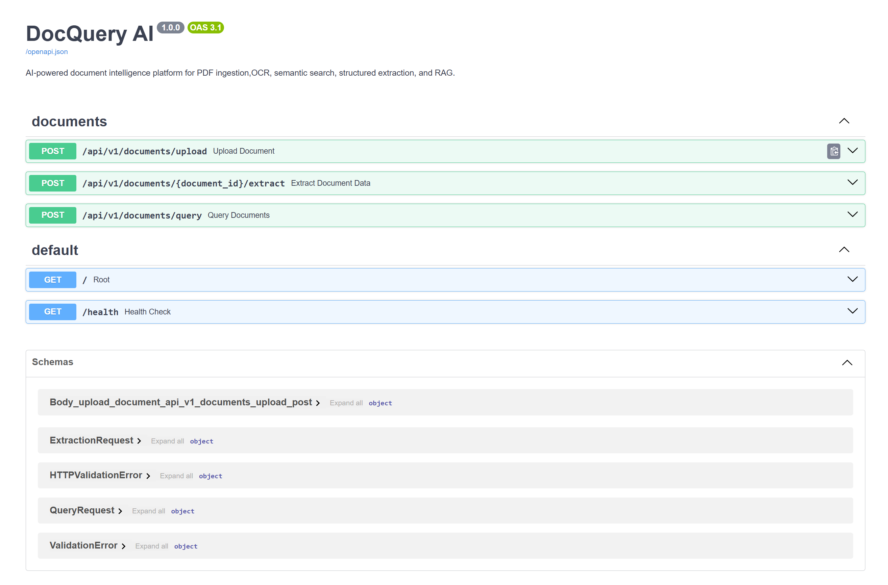
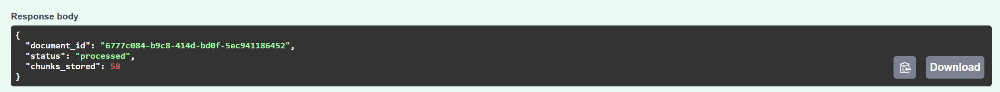
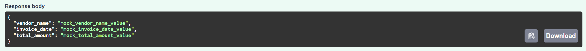
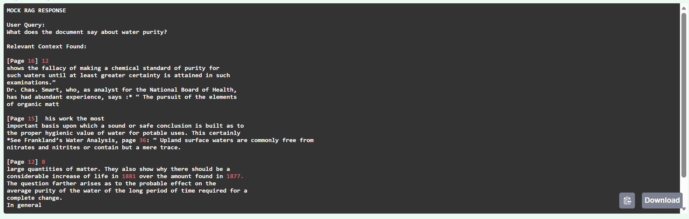
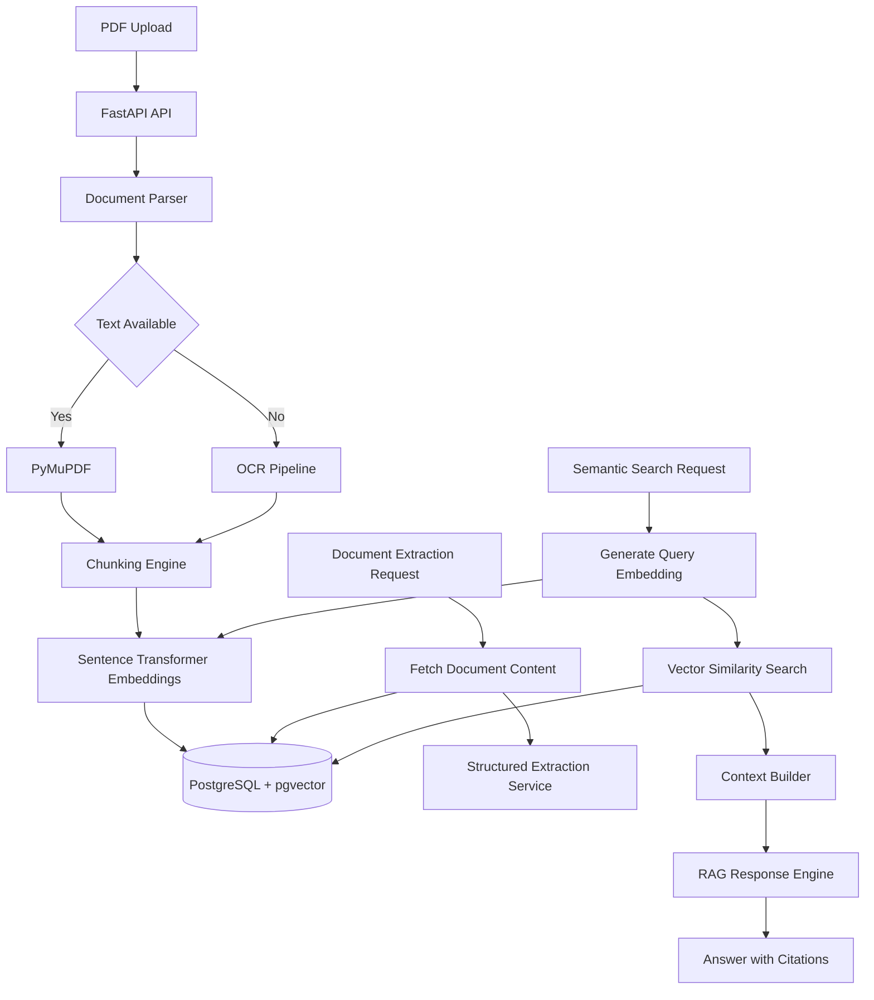

# DocQuery AI

A production-grade AI document processing backend built with FastAPI, PostgreSQL, pgvector, and Retrieval-Augmented Generation (RAG).

The system allows users to upload PDF documents, automatically extract and process text, generate vector embeddings, perform semantic search, and query documents using natural language.

**Key capabilities**:

* PDF ingestion and processing
* OCR fallback for scanned documents
* Vector search using pgvector
* Structured JSON extraction
* Citation-aware RAG responses
* Dockerized cloud deployment
* Production-ready REST API

## Demo

**Live Deployment**: https://raggg.up.railway.app

**Swagger Documentation**: https://raggg.up.railway.app/docs

## Demo Video

Watch the project walkthrough: https://youtu.be/wPZcJZ9lr8g



## Why I Built This

Many organizations store critical information inside contracts, invoices, reports, and scanned PDFs. Traditional keyword search struggles to retrieve relevant information from these documents efficiently.

DocQuery AI transforms unstructured PDF documents into searchable knowledge by combining OCR, vector embeddings, semantic retrieval, and Retrieval-Augmented Generation (RAG).

Users can upload documents, extract structured information, and ask natural language questions while receiving citation-backed responses grounded in the source material.

## Screenshots

### Document Upload



### Structured Extraction



### Semantic Query & Citations




## Highlights

* Production-ready FastAPI backend
* OCR fallback for scanned PDF documents
* PostgreSQL + pgvector vector database
* Semantic document retrieval
* Retrieval-Augmented Generation (RAG)
* Structured JSON extraction
* Dockerized deployment
* Cloud-hosted on Railway

---

## 1. System Architecture

The following diagram illustrates the complete end-to-end data processing orchestration, from document ingestion to vector search execution and RAG streaming.


## Tech Stack

### Backend

* Python 3.11
* FastAPI
* Async SQLAlchemy

### Database

* PostgreSQL
* Supabase
* pgvector

### AI & Search

* Vector Similarity Search
* Sentence Transformers
* Retrieval-Augmented Generation (RAG)

### Document Processing

* PyMuPDF
* pdfplumber
* Tesseract OCR

### Infrastructure

* Docker
* Railway

---

## 2. API Contract Specification

### Ingestion Engine

* **Endpoint:** `POST /api/v1/documents/upload`
* **Content-Type:** `multipart/form-data`

| Parameter | Type | Required | Description |
| --- | --- | --- | --- |
| `file` | Binary (PDF) | Yes | Target PDF file to segment, vectorize, and index. |

**Response (`200 OK`):**

```json
{
  "document_id": "423f7c46-9d2a-412e-a5be-9a3b2b1a8f33",
  "status": "processed",
  "chunks_stored": 45
}

```

### Structured Data Extraction

* **Endpoint:** `POST /api/v1/documents/{document_id}/extract`
* **Content-Type:** `application/json`

| Field | Type | Required | Description |
| --- | --- | --- | --- |
| `fields` | Array[String] | Yes | Keys or entities to discover and format. |
| `mock` | Boolean | No | Bypass upstream LLM calls during execution testing. |

**Request Body:**

```json
{
  "fields": ["total_amount", "vendor_name", "invoice_date"],
  "mock": false
}

```

**Response (`200 OK`):**

```json
{
  "total_amount": "$4,500.00",
  "vendor_name": "Acme Corp",
  "invoice_date": "2023-10-24"
}

```

### Contextual RAG Search

* **Endpoint:** `POST /api/v1/documents/query`
* **Content-Type:** `application/json`

| Field | Type | Required | Description |
| --- | --- | --- | --- |
| `query` | String | Yes | Semantic prompt or question to resolve. |
| `document_ids` | Array[UUID] | No | Target scope restriction. If omitted, queries entire database. |
| `top_k` | Integer | No | Count of contextual vector matches to fetch (Default: 5). |

**Request Body:**

```json
{
  "query": "What is the liability cap in this contract?",
  "document_ids": ["423f7c46-9d2a-412e-a5be-9a3b2b1a8f33"],
  "top_k": 3
}

```

**Response (`200 OK` - `text/plain` Stream):**

```text
The liability cap specified under Section 9.1 of the agreement is limited to a maximum total of $50,000 [Page 12].

__CITATIONS__
[{"document_id": "423f7c46-9d2a-412e-a5be-9a3b2b1a8f33", "page": 12, "chunk_index": 24}]

```

---


## 3. Local Development


```bash
git clone <repository-url>
cd docquery-ai

python -m venv venv
source venv/bin/activate

pip install -r requirements.txt

uvicorn app.main:app --reload
```

The application requires PostgreSQL with pgvector enabled and appropriate environment variables configured before execution.


